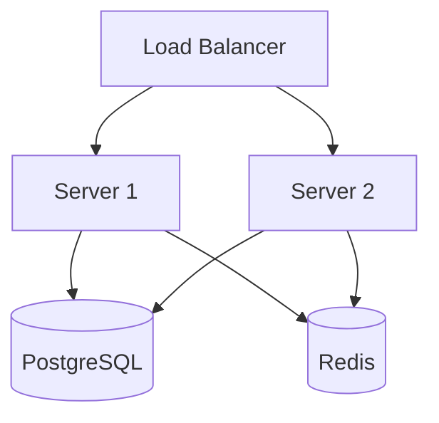
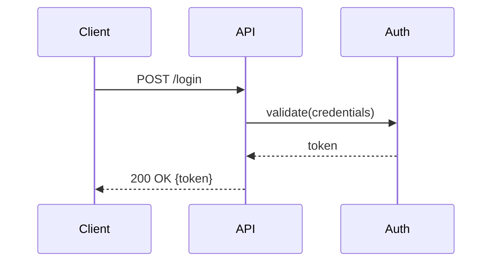
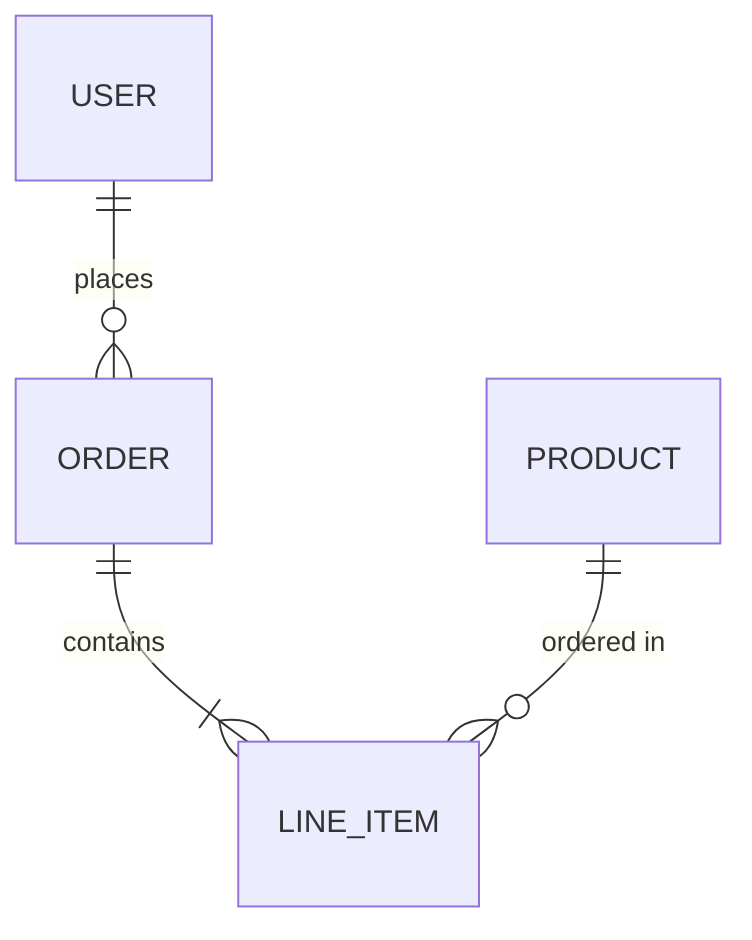
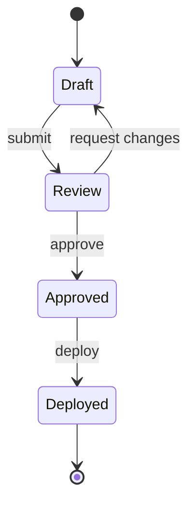
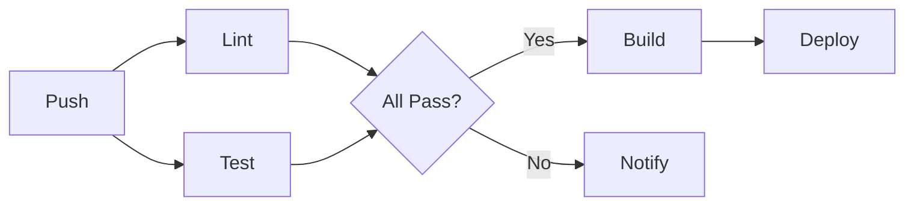

# Diagram Generation

Use `mmdc` (mermaid-cli) to render diagrams as PNG/SVG.

## Usage
```bash
# Write mermaid to file, then render
cat > /tmp/diagram.mmd << 'EOF'
graph TD
    A[Client] --> B[API Gateway]
    B --> C[Auth Service]
    B --> D[App Service]
    D --> E[(Database)]
EOF

mmdc -i /tmp/diagram.mmd -o diagram.png          # PNG output
mmdc -i /tmp/diagram.mmd -o diagram.svg           # SVG output
mmdc -i /tmp/diagram.mmd -o diagram.png -w 1200   # custom width
mmdc -i /tmp/diagram.mmd -o diagram.pdf           # PDF output
```

## Diagram Types

### Architecture / System Design


### Sequence Diagram


### Entity Relationship


### Git Flow
```mermaid
gitgraph
    commit
    branch feature
    commit
    commit
    checkout main
    merge feature
    commit
```

### State Diagram


### Flowchart (CI/CD Pipeline)


## Workflow
1. Write mermaid syntax to a `.mmd` file.
2. Render with `mmdc -i input.mmd -o output.png`.
3. For docs, use SVG: `mmdc -i input.mmd -o output.svg`.
4. Store diagrams in `docs/diagrams/` or project root.
5. Reference in README: ``.

## Tips
- Use `graph TD` (top-down) or `graph LR` (left-right) for direction.
- Keep diagrams focused — one concept per diagram.
- Use descriptive node IDs: `DB[(PostgreSQL)]` not `A[(DB)]`.
- For large systems, break into multiple diagrams.
